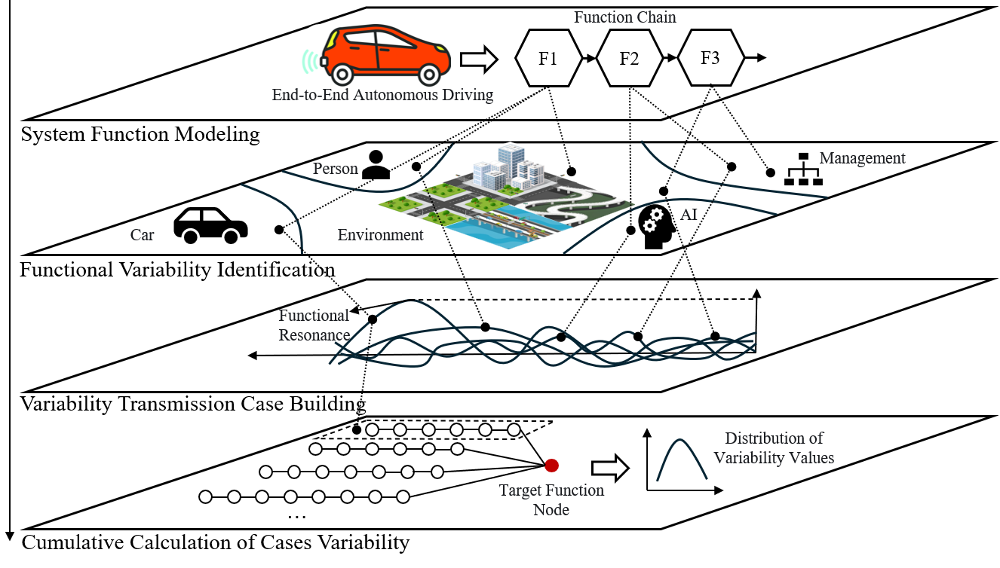
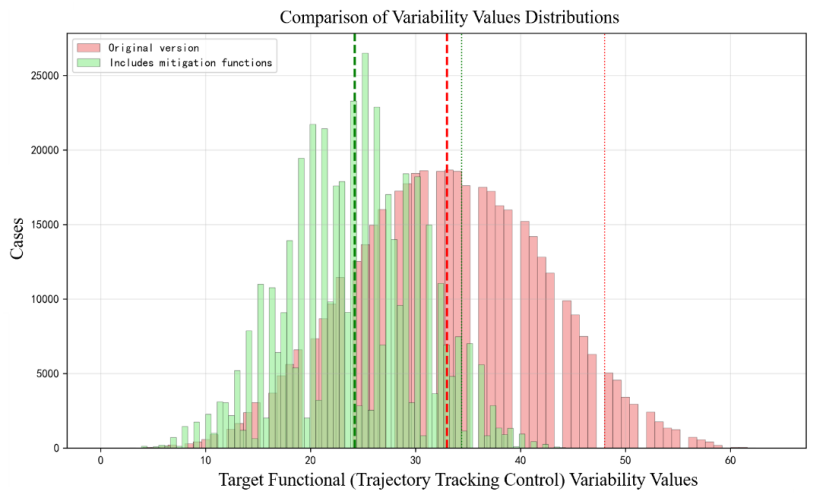

# 端到端自动驾驶 FRAM 安全分析

本仓库整理了会议论文 *An End-to-End Autonomous Driving Safety Analysis Method
Based on Functional Resonance Analysis*（ATS.2025.302）使用的两套 FRAM 模型、
边权重和变化传播分析程序。这里没有 VAD 训练代码、NuScenes 数据或驾驶图像。

## 方法概览



*图 1. 整体分析框架，直接提取自正式出版论文。*

## 运行

需要 Python 3.12 或更新版本；不需要安装第三方 Python 包。在仓库根目录运行：

```sh
python scripts/reproduce.py
python -m unittest discover -s tests -v
```

结果写入 `results/summary.csv`、`results/distribution.csv` 和
`results/provenance.json`。程序会先检查模型与权重表是否逐边对应，然后直接计算
目标节点的分布，不会生成近 1 GiB 的逐实例 JSON。

## 计算范围

- 原始模型：25 个功能、33 条边。
- 缓解模型：30 个功能、38 条边；新增功能 25–29 的内生变化固定为 0。
- 目标功能：ID 19“轨迹跟踪控制”，内生变化固定为 0。
- 其他相关功能的内生变化取 0、1、2，并假定相互独立且等权。
- 沿输入、控制、前提条件三类边传播，使用 CSV 中记录的权重。

这些假设让程序可以用卷积精确汇总所有组合，无需逐条保存。

## 论文实验结果



*图 2. 正式出版论文报告的目标节点变化分布对比（论文 Figure 5）。该图展示论文原始实验结果；由于下述复现差异，它可能与本仓库重新计算的结果不同。*

## 与论文结果的差异

这份整理版不能视为论文全部数值的完整复现。原始模型算得均值 33.00，
与论文表 6 一致，但最大值为 66.00，论文为 64.00。缓解模型算得均值
29.6875，论文为 24.20。论文正文写缓解权重为 0.1，而留存权重表有九条边
使用 0.5。`results/provenance.json` 记录了输入校验值和逐项差异。

原始 `fram_document/` 未修改。两份各约 980 MiB 的大型结果、旧版本和第三方
`framalytics/` 仓库均未复制进来。本仓库采用 Apache License 2.0，条款见
`LICENSE`。
